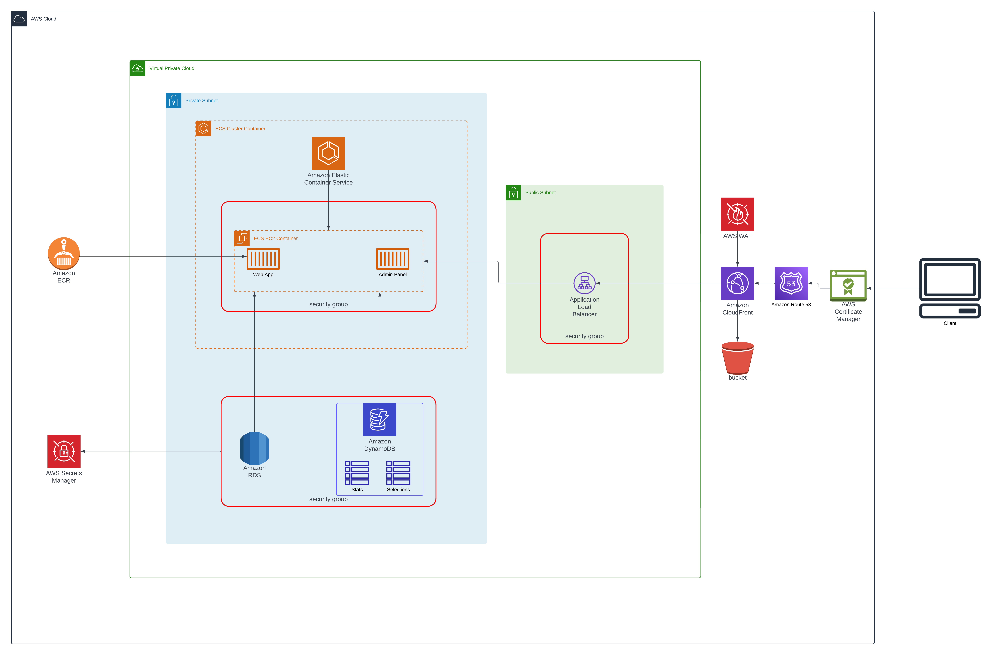

# Project Name

## Table of Contents
- [Introduction](#introduction)
- [Architecture Overview](#architecture-overview)
  - [Pre-Production](#pre-production)
  - [Production](#production)
  - [Technology Stack](#technology-stack)
- [Getting Started](#getting-started)
  - [Prerequisites](#prerequisites)
  - [Installation](#installation)
  - [Running the Application](#running-the-application)
- [Development](#development)
  - [Environment Setup](#environment-setup)
  - [Building](#building)
  - [Testing](#testing)
- [Deployment](#deployment)
  - [Containerization](#containerization)
  - [Continuous Integration / Continuous Deployment](#continuous-integration--continuous-deployment)
- [Usage](#usage)
- [Contributing](#contributing)
- [Versioning](#versioning)
- [Authors](#authors)
- [License](#license)
- [Acknowledgments](#acknowledgments)

## Introduction
The Vanguard Gaming Series: Powered by Noirè is an innovative virtual pro gaming environment designed specifically for Call of Duty, where players immerse themselves into a team-oriented gameplay format. This league mimics the classic format in which Major League Gaming was built on while adding a unique direction never seen before.

Web app for managing sports tournaments with real-time notifications and activity streams using a monolithic architecture. Integrates PostgreSQL for transactional data and Cassandra for scalable, real-time data processing. Features include user management, team management, tournament scheduling, and live updates.

Objectives:

- To Foster a Community: Build a robust community of like-minded players who are interested in a more disciplined and strategic play style, including organized teams, regular tournaments, and seasonal leagues.
- To Create Professional Pathways: Provide a platform for amateur players to showcase their skills, contributing to the e-sports ecosystem by nurturing amateur talent and offering a pathway to professional gaming careers.

## Architecture Overview

```
/vgs
│
├── /frontend
│   ├── /src
│   │   ├── /components
│   │   ├── /services
│   │   ├── /styles
│   │   └── index.js
│   ├── package.json
│   ├── .env.production
│   └── webpack.config.js (or any other build configuration)
│
└── /backend
    ├── /cmd
    │   └── /server
    │       └── main.go          # Entry point for the gRPC server
    ├── /internal
    │   ├── /api                 # gRPC service definitions
    │   │   └── api.proto
    │   ├── /service             # Business logic implementations
    │   ├── /config              # Configuration management
    │   └── /data                # Data access layer, possibly with models
    ├── go.mod
    ├── go.sum
    └── Dockerfile

```

### Pre-Production

Core Components
- User Management:
Handles user registrations, sign-ins, profile management, and security (authentication and authorization).
Use Django’s built-in user management or Spring Security for a custom user management setup in Spring Boot.

- Team Management:
Manages team creations, updates, member additions, and permissions.
Implement models for teams, members, and roles within those teams, providing APIs to manage these resources.
- Competition Management:
Allows users to create and manage competitions and tournaments.
Setup models for competition details, schedules, participants, and results.
- Notification System:
Manages sending notifications to users about events like team invitations, match schedules, and updates.
Can use external services like Firebase for real-time notifications or a simple email service for asynchronous communication.
- Admin Dashboard:
Provides a web interface for admins to CRUD operations directly related to all entities (users, teams, competitions).
Leverage Django’s admin console or Angular with Bootstrap for creating custom admin pages.

### Production


Considerations:

- Load Balancing: The use of ALB suggests that the application expects HTTP/HTTPS traffic. Make sure that the ALB is correctly configured to handle SSL termination to offload SSL processing from the ECS containers.

- Consider implementing stricter access controls, possibly via an IP whitelist or VPN access for Admin Panel Access.

- Integrate AWS CloudWatch for monitoring and logging to keep track of application and infrastructure performance.

### Technology Stack 

Frontend: Typescript, Redux for state management
Backend: gRPC based services
Database: PostgreSQL, Cassandra, Redis for Cache Layer
Infrastructure: AWS Services
CI/CD: Github Actions
